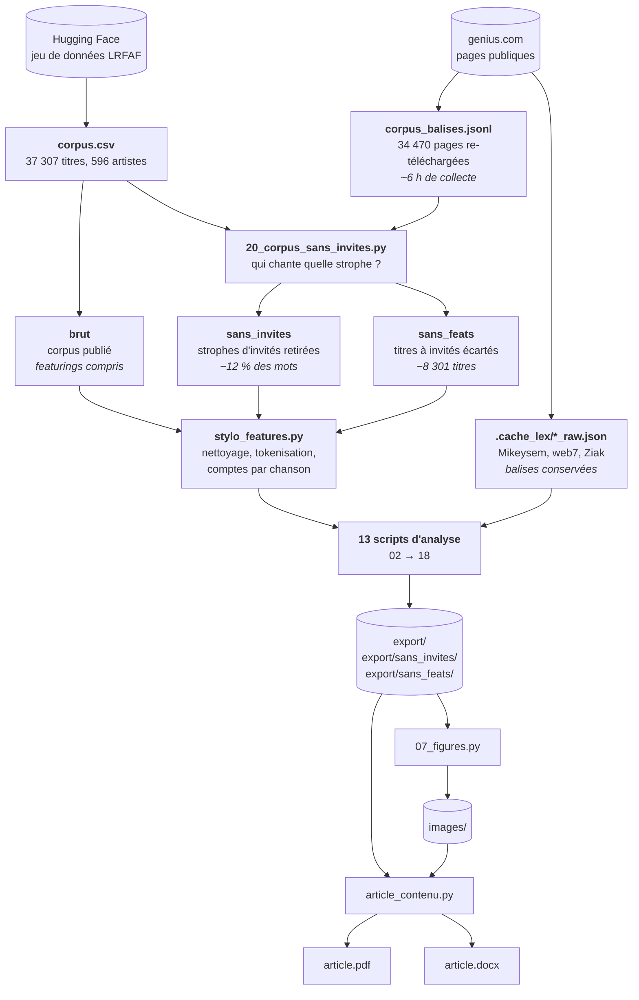
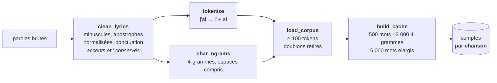
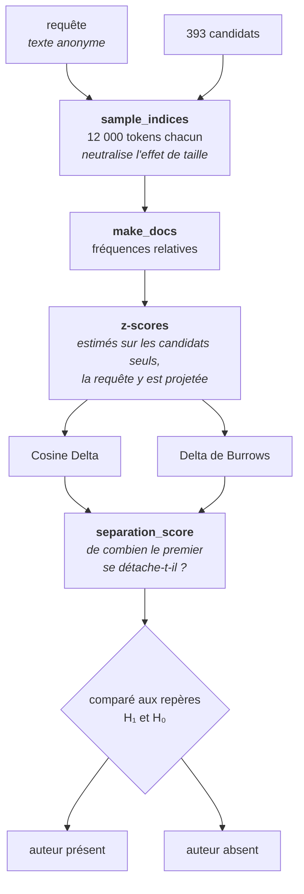
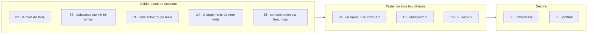

# Schéma de la chaîne de traitement

Ce document donne la vue d'ensemble : d'où viennent les données, par quoi elles
passent, et ce qui en sort. [`METHODE.md`](METHODE.md) explique les choix,
[`CODE.md`](CODE.md) détaille les blocs, [`pipeline.sh`](pipeline.sh) exécute le
tout.

---

## 1. Vue d'ensemble



**Le point à retenir** : la chaîne se dédouble après le nettoyage. Les trois
corpus traversent *exactement* le même moteur et les mêmes analyses, chacun
avec son cache et son dossier de résultats. C'est ce qui permet de dire si les
featurings ont faussé quoi que ce soit — si le verdict est le même sur les
trois, la réponse est non.

---

## 2. Le prétraitement, en détail



Deux décisions gouvernent tout le reste.

**L'apostrophe est conservée**, et la tokenisation la rattache au mot : `je` et
`j'` deviennent deux traits distincts. C'est ce qui a permis de démasquer un
faux marqueur — Ziak paraissait sous-employer « je » d'un facteur 5, alors
qu'il compense entièrement en « j' ».

**Les comptes sont stockés par chanson, jamais par artiste.** Un document
d'artiste de n'importe quelle taille se recompose ensuite par simple somme.
Sans cela, chaque rééchantillonnage exigerait de revectoriser le corpus, et le
protocole — qui en compte des centaines — serait inexécutable.

---

## 3. Le moteur d'attribution



Le dernier maillon est le plus important. Un classement désigne **toujours** un
premier : ce n'est pas une information. La question utile est de savoir de
combien il se détache — et ce que cet écart vaut, comparé aux cas où l'on
connaît la réponse.

---

## 4. Les analyses et ce qu'elles répondent



| Script | Question | Sortie principale |
|---|---|---|
| `02_` | l'approche intuitive a-t-elle raison ? | 25 % contre 91,5 % |
| `03_` | que vaut la méthode quand on connaît la réponse ? | 90 % au premier rang |
| `04_` | un artiste du corpus porte-t-il la signature de Ziak ? | **non**, les 4 analyses désignent H₀ |
| `05_` | le verdict résiste-t-il aux objections ? | oui, sur les quatre testées |
| `06_` | à quoi ressemble son écriture ? | banal au centre, sans proche parent |
| `08_09_` | Mikeysem au format LRFAF | `mikeysem_lrfaf.csv` |
| `10_` | Ziak est-il Mikeysem ? | **non**, 58ᵉ sur 493 |
| `13_14_` | la validation tient-elle sur des cas réels ? | Joke → Ateyaba retrouvé 1ᵉʳ sur 393 |
| `15_16_` | web7 écrit-il ses textes ? | **non**, mais co-auteur crédité de 10 titres |
| `18_` | les featurings faussent-ils le classement ? | non — mesuré, pas supposé |

L'ordre n'est pas décoratif : **la validation précède les tests**. Un résultat
négatif n'a de valeur que si l'on a d'abord établi que la méthode sait trouver
quand il y a quelque chose à trouver.

---

## 5. Où vivent les fichiers

```
corpus.csv                      corpus publié            (non versionné, 114 Mo)
corpus_sans_invites.csv         option 2                 (non versionné)
corpus_sans_feats.csv           option 1                 (non versionné)

.cache_lex/                     collectes Genius brutes   (non versionné)
.cache_stylo[_variante]/        comptes par chanson       (non versionné)

export/                         résultats · corpus publié
export/sans_invites/            résultats · option 2
export/sans_feats/              résultats · option 1
images/[variante]/              figures

article_ziak_stylometrie.pdf    l'article
article_ziak_stylometrie.docx   le même, éditable
```

Rien de volumineux n'est versionné, et rien de versionné n'est irremplaçable :
tout se régénère depuis `./pipeline.sh`. Les seuls fichiers irremplaçables sont
le code, et `mikeysem_lrfaf.csv` — dont la collecte dépend de pages Genius qui
peuvent disparaître.

---

## 6. Durées

```mermaid
gantt
    title Une exécution complète, à partir de rien
    dateFormat  HH:mm
    axisFormat  %Hh%M
    section Données
    corpus + cache          :a1, 00:00, 2m
    collectes Genius        :a2, after a1, 5m
    section Étude
    analyses corpus publié  :b1, after a2, 15m
    section Nettoyage
    re-collecte balisée     :crit, c1, after b1, 360m
    corpus propres          :c2, after c1, 3m
    variantes               :c3, after c2, 20m
    section Sortie
    figures + article       :d1, after c3, 3m
```



Une exécution complète demande **un peu plus de sept heures**, dont six pour la
seule re-collecte des pages Genius. Toutes les étapes étant idempotentes, on ne
la paie qu'une fois : les relances ultérieures durent une quarantaine de
minutes.
